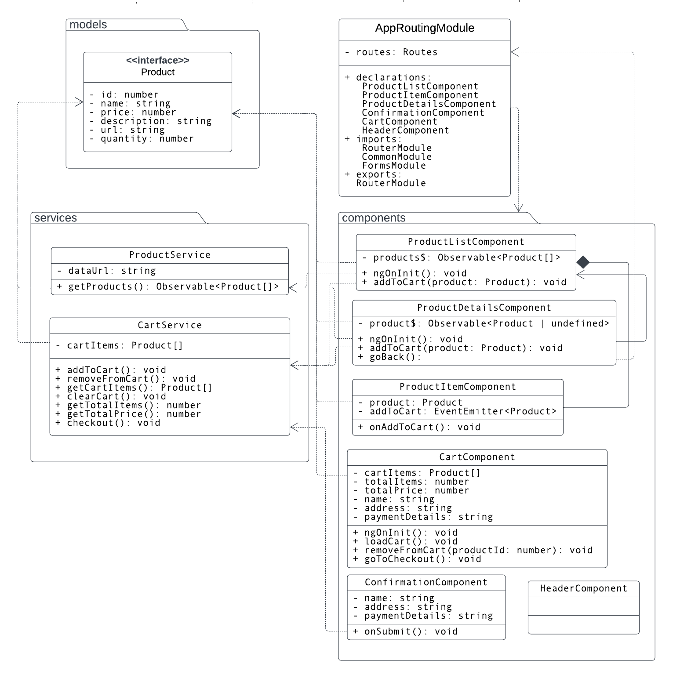

# MyStore Project Overview

MyStore is Angular application that allows users to view a list of available products to purchase, add them to a shopping cart, and ultimately complete the checkout process.

## Getting Started

To run the MyStore project, follow these steps:

1. **Clone the repository**:
   ```bash
   git clone https://github.com/polarbeargo/nd-0067-c3-angular-fundamentals-project-starter.git
   ```
2. **Navigate to the project directory**:
   ```bash
    cd mystore
   ```
3. **Install dependencies**:
   ```bash
   npm install
   ```
4. **Run the application**:
   ```bash
   ng serve
   ```
5. **Open your browser** and navigate to `http://localhost:4200` to view the application.

5. Unit tests can be run using:
   ```bash
   ng test
   ```
## Project features

- **Product list** page, which displays the available products for the user to choose and add to their cart (in various quantities)
- **Product details** page, which displays more information about any particular product
- **Shopping cart**, which includes the products that the user has added to their cart
- **Checkout form**, which collects information about the user (e.g., name, address, payment details, etc.)
- **Order confirmation page**, which shows the outcome after the user completes the checkout process (i.e., submits the checkout form)

## Development strategy

We applied the `Observer` design pattern is already built into the core and is available through the EventEmitter class. It is used to create custom events in this Angular application.

- The `async pipe` is used for subscribing to observables in `templates` and handling the lifecycle of subscriptions which is efficient in terms of memory management because it automatically handles subscriptions.
- The `BehaviorSubject` is used to hold and manage `cart state`, providing the current value to subscribers which is is efficient for state management, especially when we `emit` the current value to new subscribers immediately which helps to maintain and update state across different `components` or `services`.

1.  The `*ngFor` directive iterates over the `products emitted` by the `products$` `observable` using the `async pipe` whenever the observable `emits` new data, the template will automatically update.
2.  Each product is passed to the ProductItemComponent via the product input binding.

3. The `ProductService` is used to fetch the list of products from a static JSON file. It provides an `observable` that `emits` the product data, which is then consumed by the `ProductListComponent`.   
4.  The CartComponent will use the `CartService` to manage the cart's state, display the items in the cart, and allow users to remove items or proceed to checkout the HTML template for the CartComponent. This template will display the items in the cart, the total price, and a checkout button to navigate to a checkout `form`.  
5. The `ConfirmationComponent` integrates with the `ngModelChange` and Angular `events` to provide real-time feedback to the user during the checkout process. By using Angular's `FormsModule` to handle form validation and submission. It collects user information and payment details, and upon successful submission, it clears the cart and displays a confirmation success message.

## Software Design Architecture 


## Demonstration


## License

[License](LICENSE.txt)
